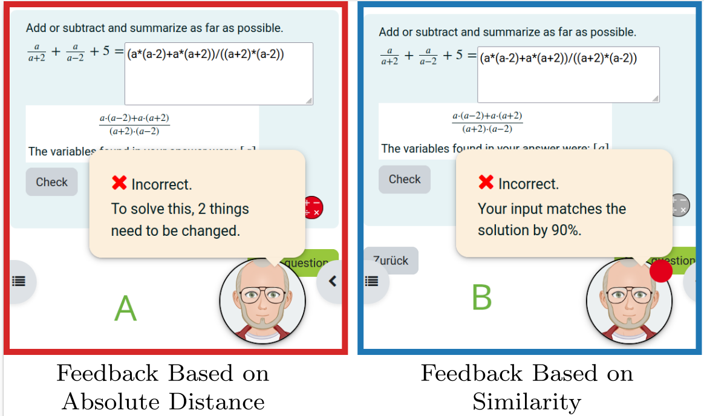

# Auto Pathfinder Feedback
This repository offers resources to implement automated feedback based on distance calculations into learning management systems (LMS) like [Moodle](https://moodle.org).

## Motivation
Contemporary LMS are capable of giving students reliable and helpful feedback on errorneous responses to digital exercises *if previously defined by instructors*, which is a time consuming task and not capable of covering any possible mistake students do. This approach is **reliable**, but **not robust.** In contrast to this, LLMs do not need this preliminary work to provide automatic feedback, but *their feedback is not 100% reliable*, as it is based on training data and hallucinations cannot be ruled out with certainty. Thus, this approach is **robust**, but **not reliable**.

The prototype presented here uses tree edit distance calculations to give automated additional distance-based feedback on students' errorneous inputs to open response mathematical questions. The such generated feedback is

 - **both robust**, as it applies to any errorneous input students may do,
 - **and reliable**, as it is based on rule-based algorithms, instead of being dependent on training data.

## Screenshots from LMS


The images each show a mathematical exercise and an incorrect student's response to it (missing the +5). Based on the Tree Edit Distance from the user's input to a possible sample solution, the left example gives the feedback "2 things need to be changed" (absolute distance feedback). The right example gives the feedback "Your inputs matches the solution by 90%" which is based on dividing the absolute distance by the sample solution's complexity and taking the revert value (see the [paper](#paper) for more information about the algorithms used and the effects on students' learning).

## Live Demo
In our [Open Moodle System](https://dub.sh/15D5EGV), click on "Attempt quiz" and enter an incorrect input to a mathematical question to see the feedback mechanism in action.

## Implementation
There are three ways to integrate the mechanism in your own Moodle system. Other LMS haven't been tested yet, but the processes will be similar. For a quick start you may want to simply [import a single question (way 1)](#way-1-import-question-file) or [import the demo quiz (way 2)](#way-2-import-demo-quiz). If you are already familiar with [STACK](https://stack-assessment.org/) questions and want to integrate the feedback into your own questions, follow the instructions in [Way 3: Manual Integration Into Questions](#way-3-manual-integration-into-questions).

### Requirements
To reproduce the resources provdided here, you need a running Moodle system with the [STACK](https://stack-assessment.org/) plugin installed.

If you additionally want to adapt the code that calculates the distances ([Way 3, step 3](#way-3-step-3)), you need [webpack](https://webpack.js.org/) to bundle [edit-distance-js](https://github.com/schulzch/edit-distance-js) into the [code provided here](src.js).

### Way 1: Import Question File
1. Download the [example question file](questions/ted_rel_example_Addition%20of%20fractions_Expand%20with%20term.xml).
1. Import the question into the question bank of your Moodle system following Moodle's [Import questions instructions](https://docs.moodle.org/405/en/Import_questions#Importing_questions_from_an_existing_file). Please not that the downloaded file is a Moodle XML file.
1. After importing, you'll find the question in your question bank and be able to duplicate it and adpat it to your needs.

### Way 2: Import Demo Quiz
1. Download the [example quiz backup file](quizzes/TED_Example_Quiz.mbz). It contains all necessary data to reproduce the [demo quiz](https://dub.sh/15D5EGV).
1. Import the downloaded file into your Moodle system following Moodle's [Course restore instructions](https://docs.moodle.org/405/en/Course_restore).
1. After restoring, you'll find the example quiz in your Moodle course and can modify it to your needs.

### Way 3: Manual Integration Into Questions
1. Append the code provided in [converttotree.mac](converttotree.mac) to the question variables box of your STACK question. The provided function allows for converting mathematical expressions into tree structured objects, which is necessary to calculate the according distances.
1. Choose at what point you want the distance-based feedback to be given to the students and insert the following code into the according boxes of your potential response tree (PRT). Note, that to enter code into the PRT, you may need to switch to the code level in Moodle's integrated text editor.
 - 2.1 <a name="way-3-step-2-1"></a>To induce the distance calculation routine, copy the code provided in [main.js](dist/main.js) and paste it into the PRT between `<script>`-tags in the following form.
```
<script>...content of main.js goes here...</script>
```
 - 2.2 To inform the distance calculation routine about the **tree of the student's input**, add the following code lines below. Replace `ans1` by the variable that contains the student's input.

```
<div class="maxima-code-output mco-student" style="display: none;">{@sconcat(converttotree(ans1))@}</div>
```
 - 2.3 To inform about the **sample solution's tree(s)** to compare with, add an arbitrary amount of the following lines, where `ta1` is to be replaced by the variable that contain a sample solution. The following example tells the system to compare the student's input to two possible sample solutions, namely `ta1` and `ta1alt`.
```
<div class="maxima-code-output mco-teacher" style="display: none;">{@sconcat(converttotree(ta1))@}</div>
<div class="maxima-code-output mco-teacher" style="display: none;">{@sconcat(converttotree(ta1alt))@}</div>
```
 - 2.4 To choose the position of the feedback, place the following line of code at the desired place.
```
<div class="maxima-code-output mco-ted-feedback mco-ted-rel"></div>
```
 - 2.5 You now can switch between
   - the similarity-based feedback by keeping `mco-ted-rel` in the code line above or
   - the absolute distance feedback by replacing `mco-ted-rel` with `mco-ted-abs`.
3. <a name="way-3-step-3"></a>If desired, you can adapt the code in `main.js` to your needs by changing the source file `src.js` and running `webpack build` in the root directory of this repository. In that case you need to redo [step 2.1](#way-3-step-2-1).

## Contact
Please don't hesitate to contact me under [malte.neugebauer@w-hs.de](malte.neugebauer@w-hs.de) if you need any help in implementing the approach or transfering it into other domains than mathematics or if you have any other questions related to the project.

## Paper
Neugebauer, M.; Falk, S.; Erlebach, R.; Higuchi, S. and Nakamura, Y. (2025): *Robust & Reliable Automated Feedback Using Tree Edit Distance for Solving Open Response Mathematical Questions.* Proceedings of the 17th International Conference on Computer Supported Education.

## License
See the [LICENSE](./LICENSE)-file for license rights and limitations (MIT).